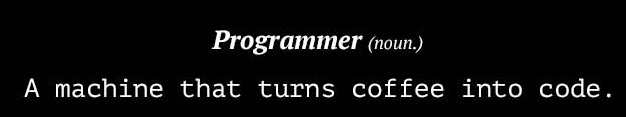

<h1 align="center">Hi 👋, I'm Dani </h1>
<h3 align="center">Telecommunication engineering from Universidad Politécnica de Madrid and aspiring fullstack developer.</h3>

## Life
### Education
- :blue_book: Bachelor of Engineering in Telecommunication Technologies and Services from [**Universidad Politécnica de Madrid**][upm]
- :blue_book: Master of Science in Telecommunication Engineering from [**Universidad Politécnica de Madrid**][upm]
### Experience
- :computer: Software Developer intership at [**Redsys**][redsys]
- :computer: Currenly I'm working as a Software Developer at [**Redsys**][redsys]

[upm]: https://www.upm.es/
[redsys]: https://www.linkedin.com/company/redsys-espa-a/

## About Me
- 🖥️ I love programming
- 🏈🎮 I also have time to watch football and play video games

## Skills (Languages and Tools)

<h3 align="left">What I control most...</h3>

  </a>     

<h3 align="left">What I've worked with but do not fully control... </h3>

 

<h3 align="left">Learning...</h3>

  

<h3 align="left">What I could see in my master degree long time ago...</h3>
<a href="https://www.mongodb.com/" target="_blank" rel="noreferrer">  

## How to reach me

You could email me at **dmiguelfernandez@gmail.com**

Or let's connect and talk! 

